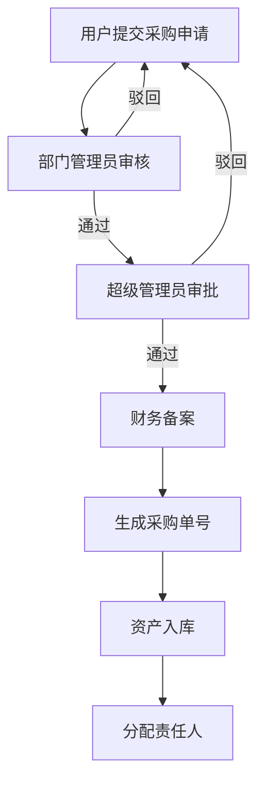
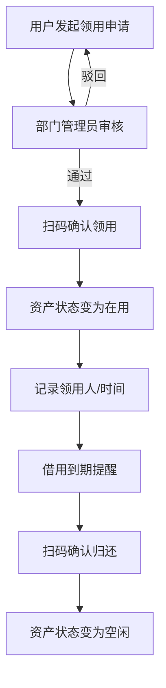
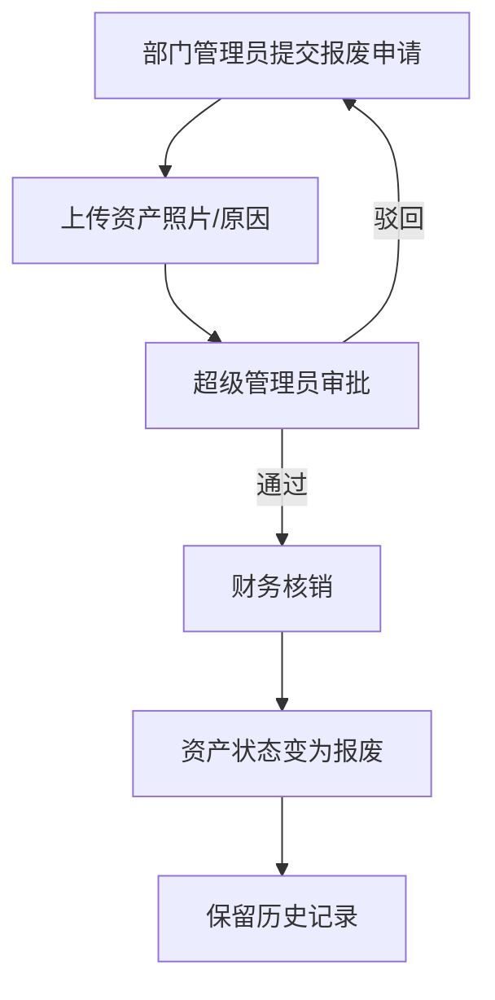

# 信创管理学院资产管理系统 - 产品需求文档

## 1. 产品概述

信创管理学院资产管理系统是符合教育部高校财务审计标准的专业资产管理平台，解决高校账实不符、责任不清、审计无据三大核心痛点。

### 目标用户
- 学校资管处（超级管理员）
- 各学院/实验室管理员（部门管理员）
- 全体师生（普通用户）

### 核心价值
- 实现资产全生命周期管理，从采购到报废全程可追溯
- 三角色权限隔离，数据安全合规
- 全链路不可篡改审计日志，满足财务审计要求
- 智能预警与数据分析，支持决策优化

---

## 2. 核心功能模块

### 2.1 用户角色定义

| 角色 | 角色说明 | 核心权限 |
|------|----------|----------|
| 超级管理员 | 资管处 | 全局数据查看、系统配置、用户管理、角色分配、数据备份恢复、跨部门审批、资产报废终审、唯一数据删除权限 |
| 部门管理员 | 学院/实验室 | 本部门资产管理、用户管理、采购/维修/调拨审批、数据导出，禁止跨部门操作 |
| 普通用户 | 师生 | 查看本人资产、发起借用/报修/归还申请、查看申请进度 |

### 2.2 功能模块列表

#### 模块1：用户认证与系统管理
1. **登录/注册**
   - 支持工号/学号登录
   - 注册需超级管理员审核

2. **个人中心**
   - 修改个人信息
   - 修改密码
   - 查看本人操作日志

3. **用户管理**
   - 超级管理员增删改查所有用户
   - 分配角色和所属部门

4. **部门管理**
   - 维护学校部门树结构
   - 支持多级部门

5. **系统配置**
   - 设置系统名称、logo
   - 预警提前天数
   - 资产折旧年限

6. **数据备份**
   - 手动备份和自动定时备份（每天凌晨2点）
   - 备份文件下载
   - 一键恢复

#### 模块2：资产全生命周期管理

##### 2.1 采购申请与审批
- 普通用户/部门管理员提交采购申请
- 审批流程：部门管理员审核 → 超级管理员审批 → 财务备案
- 支持查看申请进度、驳回原因
- 支持撤回未审批的申请

##### 2.2 资产入库管理
- 手动入库：填写资产详细信息
- 批量导入：Excel批量导入，校验失败生成错误报告
- 自动生成唯一资产二维码
- 批量打印二维码标签

##### 2.3 资产领用与归还
- 扫码完成领用
- 扫码确认归还
- 借用到期前3天自动提醒
- 超期未归还自动冻结用户权限

##### 2.4 资产调拨与维修
- 跨部门调拨流程
- 维修管理全流程
- 维修期间状态变更

##### 2.5 资产盘点与报废
- 智能盘点任务
- 盘盈、盘亏、正常报告
- 报废审批与财务核销

#### 模块3：Excel导入导出与报表管理
1. 资产数据、用户数据批量导入
2. 按角色限制导出范围
3. 财务合规报表生成

#### 模块4：智能预警与数据分析
1. 保修到期预警（提前30天）
2. 借用到期预警（提前3天）
3. 折旧到期预警（提前90天）
4. 数据可视化看板

#### 模块5：移动端专属功能
1. 扫码功能
2. 离线模式
3. 消息中心

---

## 3. 核心业务流程

### 3.1 采购入库流程

### 3.2 资产领用流程

### 3.3 资产报废流程

---

## 4. 用户界面设计

### 4.1 设计风格
- **主色调**: 深蓝色 (#165DFF) - 专业稳重
- **辅助色**:
  - 橙色 (#FF7D00) - 警告/待处理
  - 绿色 (#00B42A) - 成功/正常
  - 红色 (#F53F3F) - 错误/紧急
- **字体**: 思源黑体/思源宋体
- **风格**: 专业、简洁、稳重，符合政府/高校管理系统风格

### 4.2 导航设计
- **桌面端**: 左侧侧边栏导航
- **移动端**: 底部导航

### 4.3 响应式断点
| 设备 | 断点 | 布局特点 |
|------|------|----------|
| 移动端 | <768px | 单列布局、底部导航、大按钮 |
| 平板端 | 768px-1200px | 简化侧边栏、自适应表格 |
| 桌面端 | >1200px | 完整多列表格、侧边栏导航 |

### 4.4 核心页面设计

#### 4.4.1 登录页面
- 居中卡片式布局
- 学校Logo和系统名称
- 工号/学号 + 密码输入
- 记住登录状态选项

#### 4.4.2 管理后台首页（仪表盘）
- 顶部：用户信息、系统名称、退出按钮
- 左侧：功能导航菜单
- 中间：数据看板（卡片式统计）
- 下方：快捷操作入口

#### 4.4.3 资产管理页面
- 顶部：搜索框、筛选器、新增按钮
- 中间：数据表格（支持排序、分页、批量操作）
- 右侧/弹窗：详情查看/编辑表单

#### 4.4.4 审批流程页面
- 左侧：申请列表（状态标签）
- 右侧：申请详情
- 底部：审批操作按钮

---

## 5. 数据安全与校验规范

### 5.1 密码安全
- 使用bcrypt加密存储
- 不得明文保存

### 5.2 日期逻辑校验
- 购置日期 ≤ 入库日期 ≤ 领用日期 ≤ 归还日期 ≤ 报废日期
- 保修截止日期 ≥ 购置日期

### 5.3 数据唯一性
- 资产序列号全局唯一
- 重复序列号禁止入库

### 5.4 数值校验
- 资产价值必须为正数
- 保留两位小数

### 5.5 SQL注入/XSS防护
- 所有用户输入进行前后端双重校验
- 使用参数化查询

---

## 6. 审计日志规范

### 6.1 日志记录内容
- 操作人ID、姓名、工号
- IP地址
- 操作时间（精确到秒）
- 操作模块、操作类型
- 操作前数据快照
- 操作后数据快照
- 操作结果

### 6.2 日志特性
- 不可删除
- 不可修改
- 不可覆盖
- 仅支持超级管理员导出Excel

### 6.3 敏感操作通知
- 批量导入
- 数据删除
- 资产报废
- 批量导出
- 自动发送系统通知给所有超级管理员

---

## 7. 非功能性需求

### 7.1 性能要求
- 页面响应时间 < 2秒
- 大数据量表格支持虚拟滚动
- 支持1000+并发用户

### 7.2 可用性要求
- 7x24小时运行
- 支持Docker一键部署
- 数据定期自动备份

### 7.3 兼容性要求
- Chrome 90+
- Firefox 88+
- Safari 14+
- Edge 90+
- iOS Safari 14+
- Android Chrome 90+
