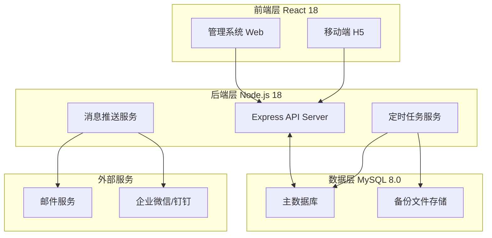
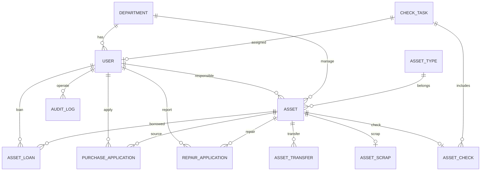

# 信创管理学院资产管理系统 - 技术架构文档

## 1. 系统架构设计



---

## 2. 技术栈说明

### 2.1 前端技术栈
| 技术 | 版本 | 用途 |
|------|------|------|
| React | 18.x | UI框架 |
| React Router | 6.x | 路由管理 |
| Tailwind CSS | 3.x | 样式框架 |
| ECharts | 5.x | 数据可视化 |
| Axios | 1.x | HTTP客户端 |
| Zustand | 4.x | 状态管理 |
| React QRCode | 0.9.x | 二维码生成 |
| ExcelJS | 4.x | Excel导入导出 |

### 2.2 后端技术栈
| 技术 | 版本 | 用途 |
|------|------|------|
| Node.js | 18.x | 运行时 |
| Express | 4.x | Web框架 |
| MySQL | 8.0 | 数据库 |
| Sequelize | 6.x | ORM框架 |
| bcrypt | 5.x | 密码加密 |
| jsonwebtoken | 9.x | JWT认证 |
| node-cron | 3.x | 定时任务 |
| multer | 1.x | 文件上传 |
| xlsx | 0.18.x | Excel处理 |
| qrcode | 1.5.x | 二维码生成 |

### 2.3 开发工具
| 技术 | 用途 |
|------|------|
| Vite | 前端构建工具 |
| Docker | 容器化部署 |
| npm/yarn | 包管理 |

---

## 3. 项目目录结构

```
asset-management-system/
├── backend/                    # 后端项目
│   ├── src/
│   │   ├── config/            # 配置文件
│   │   ├── controllers/       # 控制器
│   │   ├── middleware/         # 中间件
│   │   ├── models/            # 数据模型
│   │   ├── routes/            # 路由
│   │   ├── services/          # 业务逻辑
│   │   ├── utils/             # 工具函数
│   │   ├── cron/              # 定时任务
│   │   └── app.js             # 应用入口
│   ├── uploads/              # 上传文件目录
│   ├── backups/              # 备份文件目录
│   ├── package.json
│   └── .env
│
├── frontend/                   # 前端项目
│   ├── src/
│   │   ├── components/        # 公共组件
│   │   ├── pages/            # 页面组件
│   │   ├── services/        # API服务
│   │   ├── stores/          # 状态管理
│   │   ├── utils/           # 工具函数
│   │   ├── hooks/           # 自定义Hooks
│   │   ├── styles/          # 全局样式
│   │   ├── App.jsx
│   │   └── main.jsx
│   ├── public/
│   ├── package.json
│   └── vite.config.js
│
├── database/                  # 数据库脚本
│   ├── init.sql              # 初始化脚本
│   └── seed.sql              # 种子数据
│
├── docker/                    # Docker配置
│   ├── Dockerfile.backend
│   ├── Dockerfile.frontend
│   └── docker-compose.yml
│
└── README.md
```

---

## 4. 数据库设计

### 4.1 ER图设计



### 4.2 数据表定义

#### 4.2.1 用户表 (users)
```sql
CREATE TABLE users (
    id INT PRIMARY KEY AUTO_INCREMENT COMMENT '用户ID',
    username VARCHAR(50) NOT NULL UNIQUE COMMENT '用户名/工号/学号',
    password VARCHAR(255) NOT NULL COMMENT '密码(bcrypt加密)',
    real_name VARCHAR(50) NOT NULL COMMENT '真实姓名',
    email VARCHAR(100) COMMENT '邮箱',
    phone VARCHAR(20) COMMENT '联系电话',
    role ENUM('super_admin', 'dept_admin', 'normal_user') NOT NULL DEFAULT 'normal_user' COMMENT '角色',
    department_id INT COMMENT '所属部门ID',
    status ENUM('active', 'inactive', 'frozen') DEFAULT 'active' COMMENT '状态',
    avatar VARCHAR(255) COMMENT '头像URL',
    last_login_time DATETIME COMMENT '最后登录时间',
    last_login_ip VARCHAR(50) COMMENT '最后登录IP',
    created_at DATETIME DEFAULT CURRENT_TIMESTAMP,
    updated_at DATETIME DEFAULT CURRENT_TIMESTAMP ON UPDATE CURRENT_TIMESTAMP,
    created_by INT COMMENT '创建人ID',
    INDEX idx_role (role),
    INDEX idx_department (department_id),
    INDEX idx_status (status)
) ENGINE=InnoDB DEFAULT CHARSET=utf8mb4 COMMENT='用户表';
```

#### 4.2.2 部门表 (departments)
```sql
CREATE TABLE departments (
    id INT PRIMARY KEY AUTO_INCREMENT COMMENT '部门ID',
    name VARCHAR(100) NOT NULL COMMENT '部门名称',
    code VARCHAR(50) UNIQUE COMMENT '部门编码',
    parent_id INT COMMENT '上级部门ID',
    level INT NOT NULL DEFAULT 1 COMMENT '部门层级',
    path VARCHAR(500) COMMENT '部门路径',
    manager_id INT COMMENT '部门负责人ID',
    status ENUM('active', 'inactive') DEFAULT 'active',
    created_at DATETIME DEFAULT CURRENT_TIMESTAMP,
    updated_at DATETIME DEFAULT CURRENT_TIMESTAMP ON UPDATE CURRENT_TIMESTAMP,
    INDEX idx_parent (parent_id),
    INDEX idx_code (code)
) ENGINE=InnoDB DEFAULT CHARSET=utf8mb4 COMMENT='部门表';
```

#### 4.2.3 资产类型表 (asset_types)
```sql
CREATE TABLE asset_types (
    id INT PRIMARY KEY AUTO_INCREMENT COMMENT '类型ID',
    name VARCHAR(100) NOT NULL COMMENT '类型名称',
    code VARCHAR(50) UNIQUE COMMENT '类型编码',
    parent_id INT COMMENT '上级类型ID',
    depreciation_years INT DEFAULT 5 COMMENT '默认折旧年限',
    created_at DATETIME DEFAULT CURRENT_TIMESTAMP,
    updated_at DATETIME DEFAULT CURRENT_TIMESTAMP ON UPDATE CURRENT_TIMESTAMP,
    INDEX idx_parent (parent_id)
) ENGINE=InnoDB DEFAULT CHARSET=utf8mb4 COMMENT='资产类型表';
```

#### 4.2.4 资产表 (assets)
```sql
CREATE TABLE assets (
    id INT PRIMARY KEY AUTO_INCREMENT COMMENT '资产ID',
    asset_code VARCHAR(50) UNIQUE NOT NULL COMMENT '资产编号(系统生成)',
    serial_number VARCHAR(100) UNIQUE COMMENT '序列号',
    name VARCHAR(200) NOT NULL COMMENT '资产名称',
    type_id INT NOT NULL COMMENT '资产类型ID',
    brand VARCHAR(100) COMMENT '品牌',
    model VARCHAR(100) COMMENT '型号',
    spec VARCHAR(200) COMMENT '规格参数',
    purchase_date DATE COMMENT '购置日期',
    purchase_price DECIMAL(12,2) COMMENT '购置价格',
    net_value DECIMAL(12,2) COMMENT '当前净值',
    supplier VARCHAR(200) COMMENT '供应商',
    invoice_number VARCHAR(100) COMMENT '发票号',
    warranty_end_date DATE COMMENT '保修截止日期',
    location VARCHAR(200) COMMENT '存放位置',
    department_id INT NOT NULL COMMENT '所属部门',
    responsible_id INT NOT NULL COMMENT '责任人ID',
    status ENUM('pending', 'idle', 'in_use', 'repairing', 'transferred', 'scrapped') DEFAULT 'idle' COMMENT '状态',
    qr_code VARCHAR(255) COMMENT '二维码路径',
    purchase_application_id INT COMMENT '来源采购申请ID',
    photos JSON COMMENT '资产照片JSON数组',
    remarks TEXT COMMENT '备注',
    scrap_date DATE COMMENT '报废日期',
    scrap_reason TEXT COMMENT '报废原因',
    created_at DATETIME DEFAULT CURRENT_TIMESTAMP,
    updated_at DATETIME DEFAULT CURRENT_TIMESTAMP ON UPDATE CURRENT_TIMESTAMP,
    created_by INT COMMENT '创建人ID',
    INDEX idx_type (type_id),
    INDEX idx_department (department_id),
    INDEX idx_responsible (responsible_id),
    INDEX idx_status (status),
    INDEX idx_serial (serial_number),
    INDEX idx_purchase_date (purchase_date)
) ENGINE=InnoDB DEFAULT CHARSET=utf8mb4 COMMENT='资产表';
```

#### 4.2.5 资产领用表 (asset_loans)
```sql
CREATE TABLE asset_loans (
    id INT PRIMARY KEY AUTO_INCREMENT,
    asset_id INT NOT NULL COMMENT '资产ID',
    user_id INT NOT NULL COMMENT '领用人ID',
    department_id INT NOT NULL COMMENT '领用部门ID',
    loan_date DATE COMMENT '领用日期',
    expected_return_date DATE COMMENT '预计归还日期',
    actual_return_date DATE COMMENT '实际归还日期',
    purpose VARCHAR(500) COMMENT '领用用途',
    status ENUM('pending', 'approved', 'returned', 'overdue', 'cancelled') DEFAULT 'pending' COMMENT '状态',
    loan_method VARCHAR(20) COMMENT '领用方式: scan扫码/manual手工',
    return_method VARCHAR(20) COMMENT '归还方式: scan扫码/manual手工',
    loan_operator_id INT COMMENT '办理领用人ID',
    return_operator_id INT COMMENT '办理归还人ID',
    created_at DATETIME DEFAULT CURRENT_TIMESTAMP,
    updated_at DATETIME DEFAULT CURRENT_TIMESTAMP ON UPDATE CURRENT_TIMESTAMP,
    INDEX idx_asset (asset_id),
    INDEX idx_user (user_id),
    INDEX idx_status (status),
    INDEX idx_expected_return (expected_return_date)
) ENGINE=InnoDB DEFAULT CHARSET=utf8mb4 COMMENT='资产领用表';
```

#### 4.2.6 采购申请表 (purchase_applications)
```sql
CREATE TABLE purchase_applications (
    id INT PRIMARY KEY AUTO_INCREMENT,
    application_code VARCHAR(50) UNIQUE NOT NULL COMMENT '申请单号',
    name VARCHAR(200) NOT NULL COMMENT '资产名称',
    type_id INT COMMENT '资产类型ID',
    spec VARCHAR(200) COMMENT '规格参数',
    quantity INT NOT NULL DEFAULT 1 COMMENT '数量',
    estimated_price DECIMAL(12,2) COMMENT '预估单价',
    total_price DECIMAL(12,2) COMMENT '预估总价',
    purpose TEXT COMMENT '用途说明',
    required_date DATE COMMENT '需求日期',
    applicant_id INT NOT NULL COMMENT '申请人ID',
    department_id INT NOT NULL COMMENT '申请部门ID',
    dept_audit_status ENUM('pending', 'approved', 'rejected') DEFAULT 'pending' COMMENT '部门审核状态',
    dept_audit_id INT COMMENT '部门审核人ID',
    dept_audit_time DATETIME COMMENT '部门审核时间',
    dept_audit_remark TEXT COMMENT '部门审核意见',
    super_audit_status ENUM('pending', 'approved', 'rejected') DEFAULT 'pending' COMMENT '超级管理员审核状态',
    super_audit_id INT COMMENT '超级管理员审核人ID',
    super_audit_time DATETIME COMMENT '超级管理员审核时间',
    super_audit_remark TEXT COMMENT '超级管理员审核意见',
    status ENUM('draft', 'dept_pending', 'super_pending', 'approved', 'rejected', 'withdrawn') DEFAULT 'draft' COMMENT '状态',
    created_at DATETIME DEFAULT CURRENT_TIMESTAMP,
    updated_at DATETIME DEFAULT CURRENT_TIMESTAMP ON UPDATE CURRENT_TIMESTAMP,
    INDEX idx_applicant (applicant_id),
    INDEX idx_department (department_id),
    INDEX idx_status (status)
) ENGINE=InnoDB DEFAULT CHARSET=utf8mb4 COMMENT='采购申请表';
```

#### 4.2.7 维修申请表 (repair_applications)
```sql
CREATE TABLE repair_applications (
    id INT PRIMARY KEY AUTO_INCREMENT,
    repair_code VARCHAR(50) UNIQUE NOT NULL COMMENT '维修单号',
    asset_id INT NOT NULL COMMENT '资产ID',
    asset_name VARCHAR(200) COMMENT '资产名称(冗余)',
    reporter_id INT NOT NULL COMMENT '报修人ID',
    department_id INT NOT NULL COMMENT '报修部门ID',
    fault_description TEXT COMMENT '故障描述',
    fault_photos JSON COMMENT '故障照片JSON',
    report_date DATE COMMENT '报修日期',
    audit_status ENUM('pending', 'approved', 'rejected') DEFAULT 'pending' COMMENT '审核状态',
    audit_id INT COMMENT '审核人ID',
    audit_time DATETIME COMMENT '审核时间',
    audit_remark TEXT COMMENT '审核意见',
    repair_status ENUM('pending', 'repairing', 'completed') DEFAULT 'pending' COMMENT '维修状态',
    repair_person VARCHAR(100) COMMENT '维修人员',
    repair_start_date DATE COMMENT '维修开始日期',
    repair_end_date DATE COMMENT '维修完成日期',
    repair_cost DECIMAL(10,2) COMMENT '维修费用',
    repair_result TEXT COMMENT '维修结果',
    acceptance_status ENUM('pending', 'accepted', 'rejected') DEFAULT 'pending' COMMENT '验收状态',
    acceptance_id INT COMMENT '验收人ID',
    acceptance_time DATETIME COMMENT '验收时间',
    acceptance_remark TEXT COMMENT '验收意见',
    status ENUM('pending', 'in_repair', 'completed', 'rejected') DEFAULT 'pending',
    created_at DATETIME DEFAULT CURRENT_TIMESTAMP,
    updated_at DATETIME DEFAULT CURRENT_TIMESTAMP ON UPDATE CURRENT_TIMESTAMP,
    INDEX idx_asset (asset_id),
    INDEX idx_reporter (reporter_id),
    INDEX idx_status (status)
) ENGINE=InnoDB DEFAULT CHARSET=utf8mb4 COMMENT='维修申请表';
```

#### 4.2.8 资产调拨表 (asset_transfers)
```sql
CREATE TABLE asset_transfers (
    id INT PRIMARY KEY AUTO_INCREMENT,
    transfer_code VARCHAR(50) UNIQUE NOT NULL COMMENT '调拨单号',
    asset_id INT NOT NULL COMMENT '资产ID',
    from_department_id INT NOT NULL COMMENT '调出部门ID',
    to_department_id INT NOT NULL COMMENT '调入部门ID',
    from_responsible_id INT NOT NULL COMMENT '原责任人ID',
    to_responsible_id INT COMMENT '新责任人ID',
    transfer_reason TEXT COMMENT '调拨原因',
    from_dept_audit_status ENUM('pending', 'approved', 'rejected') DEFAULT 'pending' COMMENT '调出部门审核',
    from_dept_audit_id INT COMMENT '调出部门审核人ID',
    from_dept_audit_time DATETIME COMMENT '调出部门审核时间',
    to_dept_audit_status ENUM('pending', 'approved', 'rejected') DEFAULT 'pending' COMMENT '调入部门审核',
    to_dept_audit_id INT COMMENT '调入部门审核人ID',
    to_dept_audit_time DATETIME COMMENT '调入部门审核时间',
    super_audit_status ENUM('pending', 'approved', 'rejected') DEFAULT 'pending' COMMENT '超级管理员审核',
    super_audit_id INT COMMENT '超级管理员审核人ID',
    super_audit_time DATETIME COMMENT '超级管理员审核时间',
    super_audit_remark TEXT COMMENT '超级管理员审核意见',
    actual_transfer_date DATE COMMENT '实际调拨日期',
    status ENUM('pending', 'from_approved', 'to_approved', 'super_approved', 'completed', 'rejected') DEFAULT 'pending',
    created_at DATETIME DEFAULT CURRENT_TIMESTAMP,
    updated_at DATETIME DEFAULT CURRENT_TIMESTAMP ON UPDATE CURRENT_TIMESTAMP,
    INDEX idx_asset (asset_id),
    INDEX idx_from_dept (from_department_id),
    INDEX idx_to_dept (to_department_id),
    INDEX idx_status (status)
) ENGINE=InnoDB DEFAULT CHARSET=utf8mb4 COMMENT='资产调拨表';
```

#### 4.2.9 资产报废表 (asset_scraps)
```sql
CREATE TABLE asset_scraps (
    id INT PRIMARY KEY AUTO_INCREMENT,
    scrap_code VARCHAR(50) UNIQUE NOT NULL COMMENT '报废单号',
    asset_id INT NOT NULL COMMENT '资产ID',
    applicant_id INT NOT NULL COMMENT '申请人ID',
    department_id INT NOT NULL COMMENT '申请部门ID',
    scrap_reason TEXT NOT NULL COMMENT '报废原因',
    scrap_photos JSON COMMENT '报废照片JSON',
    original_value DECIMAL(12,2) COMMENT '原值',
    net_value DECIMAL(12,2) COMMENT '账面净值',
    audit_status ENUM('pending', 'approved', 'rejected') DEFAULT 'pending' COMMENT '审核状态',
    audit_id INT COMMENT '审核人ID',
    audit_time DATETIME COMMENT '审核时间',
    audit_remark TEXT COMMENT '审核意见',
    finance_verify_status ENUM('pending', 'verified') DEFAULT 'pending' COMMENT '财务核销状态',
    finance_verify_id INT COMMENT '财务核销人ID',
    finance_verify_time DATETIME COMMENT '财务核销时间',
    status ENUM('pending', 'approved', 'rejected', 'verified', 'completed') DEFAULT 'pending',
    created_at DATETIME DEFAULT CURRENT_TIMESTAMP,
    updated_at DATETIME DEFAULT CURRENT_TIMESTAMP ON UPDATE CURRENT_TIMESTAMP,
    INDEX idx_asset (asset_id),
    INDEX idx_applicant (applicant_id),
    INDEX idx_status (status)
) ENGINE=InnoDB DEFAULT CHARSET=utf8mb4 COMMENT='资产报废表';
```

#### 4.2.10 盘点任务表 (check_tasks)
```sql
CREATE TABLE check_tasks (
    id INT PRIMARY KEY AUTO_INCREMENT,
    task_code VARCHAR(50) UNIQUE NOT NULL COMMENT '任务编号',
    task_name VARCHAR(200) NOT NULL COMMENT '任务名称',
    department_id INT COMMENT '盘点部门ID(为空则全量)',
    start_date DATE NOT NULL COMMENT '开始日期',
    end_date DATE NOT NULL COMMENT '结束日期',
    status ENUM('pending', 'in_progress', 'completed', 'cancelled') DEFAULT 'pending' COMMENT '状态',
    created_by INT NOT NULL COMMENT '创建人ID',
    total_assets INT DEFAULT 0 COMMENT '总资产数',
    normal_count INT DEFAULT 0 COMMENT '正常数',
    profit_count INT DEFAULT 0 COMMENT '盘盈数',
    loss_count INT DEFAULT 0 COMMENT '盘亏数',
    checked_count INT DEFAULT 0 COMMENT '已盘点数',
    created_at DATETIME DEFAULT CURRENT_TIMESTAMP,
    updated_at DATETIME DEFAULT CURRENT_TIMESTAMP ON UPDATE CURRENT_TIMESTAMP,
    INDEX idx_department (department_id),
    INDEX idx_status (status)
) ENGINE=InnoDB DEFAULT CHARSET=utf8mb4 COMMENT='盘点任务表';
```

#### 4.2.11 盘点记录表 (asset_checks)
```sql
CREATE TABLE asset_checks (
    id INT PRIMARY KEY AUTO_INCREMENT,
    task_id INT NOT NULL COMMENT '盘点任务ID',
    asset_id INT NOT NULL COMMENT '资产ID',
    checker_id INT NOT NULL COMMENT '盘点人ID',
    check_date DATE NOT NULL COMMENT '盘点日期',
    check_method ENUM('scan', 'manual') DEFAULT 'scan' COMMENT '盘点方式',
    check_result ENUM('normal', 'profit', 'loss', 'not_found') DEFAULT 'normal' COMMENT '盘点结果',
    actual_location VARCHAR(200) COMMENT '实际位置',
    actual_status VARCHAR(50) COMMENT '实际状态',
    remarks TEXT COMMENT '备注',
    created_at DATETIME DEFAULT CURRENT_TIMESTAMP,
    INDEX idx_task (task_id),
    INDEX idx_asset (asset_id),
    INDEX idx_checker (checker_id),
    INDEX idx_result (check_result)
) ENGINE=InnoDB DEFAULT CHARSET=utf8mb4 COMMENT='盘点记录表';
```

#### 4.2.12 审计日志表 (audit_logs)
```sql
CREATE TABLE audit_logs (
    id BIGINT PRIMARY KEY AUTO_INCREMENT COMMENT '日志ID',
    user_id INT NOT NULL COMMENT '操作人ID',
    user_name VARCHAR(50) COMMENT '操作人姓名',
    user_code VARCHAR(50) COMMENT '操作人工号/学号',
    ip_address VARCHAR(50) COMMENT 'IP地址',
    module VARCHAR(100) NOT NULL COMMENT '操作模块',
    action VARCHAR(50) NOT NULL COMMENT '操作类型',
    action_name VARCHAR(100) COMMENT '操作名称',
    entity_type VARCHAR(50) COMMENT '操作对象类型',
    entity_id INT COMMENT '操作对象ID',
    before_data JSON COMMENT '操作前数据快照',
    after_data JSON COMMENT '操作后数据快照',
    result ENUM('success', 'failed') DEFAULT 'success' COMMENT '操作结果',
    error_message TEXT COMMENT '错误信息',
    user_agent VARCHAR(500) COMMENT '浏览器信息',
    operate_time DATETIME DEFAULT CURRENT_TIMESTAMP COMMENT '操作时间',
    INDEX idx_user (user_id),
    INDEX idx_module (module),
    INDEX idx_action (action),
    INDEX idx_entity (entity_type, entity_id),
    INDEX idx_time (operate_time),
    INDEX idx_ip (ip_address)
) ENGINE=InnoDB DEFAULT CHARSET=utf8mb4 COMMENT='审计日志表';
```

#### 4.2.13 系统通知表 (notifications)
```sql
CREATE TABLE notifications (
    id INT PRIMARY KEY AUTO_INCREMENT,
    title VARCHAR(200) NOT NULL COMMENT '通知标题',
    content TEXT COMMENT '通知内容',
    type ENUM('system', 'approval', 'warning', 'reminder') NOT NULL COMMENT '通知类型',
    sender_id INT COMMENT '发送人ID',
    recipient_id INT COMMENT '接收人ID(为空则全体)',
    recipient_role VARCHAR(50) COMMENT '接收人角色',
    related_module VARCHAR(50) COMMENT '关联模块',
    related_id INT COMMENT '关联ID',
    is_read TINYINT DEFAULT 0 COMMENT '是否已读',
    read_time DATETIME COMMENT '阅读时间',
    created_at DATETIME DEFAULT CURRENT_TIMESTAMP,
    INDEX idx_recipient (recipient_id),
    INDEX idx_type (type),
    INDEX idx_is_read (is_read),
    INDEX idx_created (created_at)
) ENGINE=InnoDB DEFAULT CHARSET=utf8mb4 COMMENT='系统通知表';
```

#### 4.2.14 系统配置表 (system_configs)
```sql
CREATE TABLE system_configs (
    id INT PRIMARY KEY AUTO_INCREMENT,
    config_key VARCHAR(100) UNIQUE NOT NULL COMMENT '配置键',
    config_value TEXT COMMENT '配置值',
    config_name VARCHAR(200) COMMENT '配置名称',
    config_type VARCHAR(50) COMMENT '配置类型',
    description VARCHAR(500) COMMENT '配置说明',
    editable TINYINT DEFAULT 1 COMMENT '是否可编辑',
    created_at DATETIME DEFAULT CURRENT_TIMESTAMP,
    updated_at DATETIME DEFAULT CURRENT_TIMESTAMP ON UPDATE CURRENT_TIMESTAMP
) ENGINE=InnoDB DEFAULT CHARSET=utf8mb4 COMMENT='系统配置表';
```

#### 4.2.15 数据备份记录表 (backup_records)
```sql
CREATE TABLE backup_records (
    id INT PRIMARY KEY AUTO_INCREMENT,
    backup_name VARCHAR(200) NOT NULL COMMENT '备份名称',
    backup_file VARCHAR(500) NOT NULL COMMENT '备份文件路径',
    backup_type ENUM('manual', 'auto') NOT NULL COMMENT '备份类型',
    backup_size BIGINT COMMENT '备份文件大小(字节)',
    status ENUM('success', 'failed') NOT NULL COMMENT '备份状态',
    error_message TEXT COMMENT '错误信息',
    backup_by INT COMMENT '备份操作人ID',
    created_at DATETIME DEFAULT CURRENT_TIMESTAMP,
    INDEX idx_type (backup_type),
    INDEX idx_status (status),
    INDEX idx_created (created_at)
) ENGINE=InnoDB DEFAULT CHARSET=utf8mb4 COMMENT='数据备份记录表';
```

---

## 5. API接口设计

### 5.1 认证模块

| 接口 | 方法 | 路径 | 描述 |
|------|------|------|------|
| 登录 | POST | /api/auth/login | 用户登录 |
| 注册 | POST | /api/auth/register | 用户注册 |
| 登出 | POST | /api/auth/logout | 用户登出 |
| 获取当前用户 | GET | /api/auth/current | 获取当前用户信息 |
| 修改密码 | PUT | /api/auth/password | 修改密码 |

### 5.2 用户管理模块

| 接口 | 方法 | 路径 | 描述 |
|------|------|------|------|
| 获取用户列表 | GET | /api/users | 获取用户列表(分页) |
| 获取用户详情 | GET | /api/users/:id | 获取用户详情 |
| 创建用户 | POST | /api/users | 创建用户 |
| 更新用户 | PUT | /api/users/:id | 更新用户 |
| 删除用户 | DELETE | /api/users/:id | 删除用户 |
| 更新用户状态 | PUT | /api/users/:id/status | 更新用户状态 |
| 重置密码 | PUT | /api/users/:id/reset-password | 重置用户密码 |

### 5.3 部门管理模块

| 接口 | 方法 | 路径 | 描述 |
|------|------|------|------|
| 获取部门树 | GET | /api/departments/tree | 获取部门树形结构 |
| 获取部门列表 | GET | /api/departments | 获取部门列表 |
| 获取部门详情 | GET | /api/departments/:id | 获取部门详情 |
| 创建部门 | POST | /api/departments | 创建部门 |
| 更新部门 | PUT | /api/departments/:id | 更新部门 |
| 删除部门 | DELETE | /api/departments/:id | 删除部门 |

### 5.4 资产管理模块

| 接口 | 方法 | 路径 | 描述 |
|------|------|------|------|
| 获取资产列表 | GET | /api/assets | 获取资产列表(分页) |
| 获取资产详情 | GET | /api/assets/:id | 获取资产详情 |
| 创建资产 | POST | /api/assets | 创建资产 |
| 更新资产 | PUT | /api/assets/:id | 更新资产 |
| 删除资产 | DELETE | /api/assets/:id | 删除资产 |
| 批量导入资产 | POST | /api/assets/import | 批量导入资产 |
| 导出资产 | GET | /api/assets/export | 导出资产 |
| 打印二维码 | GET | /api/assets/:id/qrcode | 打印资产二维码 |
| 批量打印二维码 | POST | /api/assets/qrcodes/batch-print | 批量打印二维码 |

### 5.5 采购申请模块

| 接口 | 方法 | 路径 | 描述 |
|------|------|------|------|
| 获取申请列表 | GET | /api/purchases | 获取采购申请列表 |
| 获取申请详情 | GET | /api/purchases/:id | 获取采购申请详情 |
| 创建申请 | POST | /api/purchases | 创建采购申请 |
| 更新申请 | PUT | /api/purchases/:id | 更新采购申请 |
| 撤回申请 | PUT | /api/purchases/:id/withdraw | 撤回采购申请 |
| 部门审核 | PUT | /api/purchases/:id/dept-audit | 部门审核采购申请 |
| 超级审核 | PUT | /api/purchases/:id/super-audit | 超级管理员审核 |

### 5.6 资产领用模块

| 接口 | 方法 | 路径 | 描述 |
|------|------|------|------|
| 获取领用列表 | GET | /api/loans | 获取领用记录列表 |
| 发起领用申请 | POST | /api/loans | 发起领用申请 |
| 审核领用申请 | PUT | /api/loans/:id/approve | 审核领用申请 |
| 扫码领用确认 | POST | /api/loans/scan-confirm | 扫码确认领用 |
| 扫码归还确认 | POST | /api/loans/scan-return | 扫码确认归还 |

### 5.7 维修管理模块

| 接口 | 方法 | 路径 | 描述 |
|------|------|------|------|
| 获取维修列表 | GET | /api/repairs | 获取维修记录列表 |
| 提交报修 | POST | /api/repairs | 提交报修申请 |
| 审核报修 | PUT | /api/repairs/:id/audit | 审核报修申请 |
| 开始维修 | PUT | /api/repairs/:id/start-repair | 开始维修 |
| 完成维修 | PUT | /api/repairs/:id/complete-repair | 完成维修 |
| 验收维修 | PUT | /api/repairs/:id/acceptance | 验收维修 |

### 5.8 资产调拨模块

| 接口 | 方法 | 路径 | 描述 |
|------|------|------|------|
| 获取调拨列表 | GET | /api/transfers | 获取调拨记录列表 |
| 发起调拨 | POST | /api/transfers | 发起调拨申请 |
| 调出部门审核 | PUT | /api/transfers/:id/from-dept-audit | 调出部门审核 |
| 调入部门审核 | PUT | /api/transfers/:id/to-dept-audit | 调入部门审核 |
| 超级管理员审核 | PUT | /api/transfers/:id/super-audit | 超级管理员审核 |

### 5.9 资产报废模块

| 接口 | 方法 | 路径 | 描述 |
|------|------|------|------|
| 获取报废列表 | GET | /api/scraps | 获取报废记录列表 |
| 发起报废 | POST | /api/scraps | 发起报废申请 |
| 审核报废 | PUT | /api/scraps/:id/audit | 审核报废申请 |
| 财务核销 | PUT | /api/scraps/:id/finance-verify | 财务核销 |

### 5.10 资产盘点模块

| 接口 | 方法 | 路径 | 描述 |
|------|------|------|------|
| 获取盘点任务 | GET | /api/checks | 获取盘点任务列表 |
| 创建盘点任务 | POST | /api/checks | 创建盘点任务 |
| 获取任务资产 | GET | /api/checks/:id/assets | 获取任务资产列表 |
| 扫码盘点 | POST | /api/checks/:id/scan | 扫码盘点 |
| 手动盘点 | POST | /api/checks/:id/manual | 手动盘点 |
| 生成盘点报告 | GET | /api/checks/:id/report | 生成盘点报告 |

### 5.11 审计日志模块

| 接口 | 方法 | 路径 | 描述 |
|------|------|------|------|
| 获取日志列表 | GET | /api/audit-logs | 获取审计日志列表 |
| 导出日志 | GET | /api/audit-logs/export | 导出审计日志 |

### 5.12 系统配置模块

| 接口 | 方法 | 路径 | 描述 |
|------|------|------|------|
| 获取配置 | GET | /api/system-configs | 获取系统配置 |
| 更新配置 | PUT | /api/system-configs | 更新系统配置 |
| 数据备份 | POST | /api/backups | 创建数据备份 |
| 获取备份列表 | GET | /api/backups | 获取备份列表 |
| 下载备份 | GET | /api/backups/:id/download | 下载备份文件 |
| 恢复备份 | POST | /api/backups/:id/restore | 恢复备份数据 |

### 5.13 通知模块

| 接口 | 方法 | 路径 | 描述 |
|------|------|------|------|
| 获取通知列表 | GET | /api/notifications | 获取通知列表 |
| 标记已读 | PUT | /api/notifications/:id/read | 标记通知已读 |
| 全部已读 | PUT | /api/notifications/read-all | 全部标记已读 |

### 5.14 统计报表模块

| 接口 | 方法 | 路径 | 描述 |
|------|------|------|------|
| 仪表盘统计 | GET | /api/statistics/dashboard | 获取仪表盘统计数据 |
| 资产总账 | GET | /api/statistics/assets-ledger | 资产总账报表 |
| 部门分布 | GET | /api/statistics/department-distribution | 部门资产分布 |
| 折旧报表 | GET | /api/statistics/depreciation | 折旧报表 |
| 维修统计 | GET | /api/statistics/repairs | 维修费用统计 |
| 采购统计 | GET | /api/statistics/purchases | 采购统计 |
| 变动报表 | GET | /api/statistics/changes | 资产增减变动报表 |

---

## 6. 统一响应格式

### 6.1 成功响应
```json
{
    "code": 200,
    "message": "success",
    "data": {
        "items": [],
        "total": 0,
        "page": 1,
        "pageSize": 10
    }
}
```

### 6.2 错误响应
```json
{
    "code": 400,
    "message": "错误信息",
    "error": "详细错误信息(仅开发环境)"
}
```

### 6.3 HTTP状态码说明
| 状态码 | 说明 |
|--------|------|
| 200 | 成功 |
| 201 | 创建成功 |
| 400 | 请求参数错误 |
| 401 | 未授权/登录过期 |
| 403 | 权限不足 |
| 404 | 资源不存在 |
| 500 | 服务器内部错误 |

---

## 7. 认证与授权

### 7.1 JWT Token结构
```json
{
    "userId": 1,
    "username": "admin",
    "role": "super_admin",
    "departmentId": 1,
    "exp": 1234567890
}
```

### 7.2 权限矩阵

| 功能 | 超级管理员 | 部门管理员 | 普通用户 |
|------|------------|------------|----------|
| 用户管理 | CRUD | R(本部门) | - |
| 部门管理 | CRUD | R | - |
| 资产查看 | 全部 | 本部门 | 本人资产 |
| 资产增删改 | CRUD | CUD(本部门) | - |
| 采购申请 | R | CRUD(本部门) | CR(本人) |
| 采购审批 | ✓(终审) | ✓(初审) | - |
| 领用审批 | - | ✓ | - |
| 维修审批 | - | ✓ | - |
| 调拨审批 | ✓(终审) | ✓(部门) | - |
| 报废审批 | ✓(终审) | C(本部门) | - |
| 盘点任务 | CRUD | CRUD(本部门) | 执行 |
| 审计日志 | R+导出 | R(本部门) | R(本人) |
| 系统配置 | CRUD | R | - |
| 数据备份 | CRUD | - | - |

---

## 8. 定时任务

### 8.1 每日凌晨2:00 - 自动备份
```javascript
// 备份数据库
cron.schedule('0 2 * * *', async () => {
    await backupDatabase();
});
```

### 8.2 每日凌晨3:00 - 逾期检测
```javascript
// 检测逾期未归还资产，冻结用户权限，发送通知
cron.schedule('0 3 * * *', async () => {
    await checkOverdueLoans();
});
```

### 8.3 每日8:00 - 预警通知
```javascript
// 发送保修到期、借用到期、折旧到期预警
cron.schedule('0 8 * * *', async () => {
    await sendWarningNotifications();
});
```

### 8.4 每日凌晨4:00 - 折旧计算
```javascript
// 计算资产折旧，更新净值
cron.schedule('0 4 * * *', async () => {
    await calculateDepreciation();
});
```

---

## 9. 安全措施

### 9.1 密码安全
- bcrypt加密，强度10
- 密码至少8位，包含大小写字母和数字

### 9.2 SQL注入防护
- 使用Sequelize ORM参数化查询
- 输入数据严格校验

### 9.3 XSS防护
- 前端输入转义
- 后端存储原文，输出时转义

### 9.4 CORS配置
- 仅允许指定域名访问API
- 支持Cookie跨域

### 9.5 请求限流
- 登录接口：5次/分钟
- 其他接口：100次/分钟

---

## 10. Docker部署架构

```yaml
# docker-compose.yml
version: '3.8'
services:
  mysql:
    image: mysql:8.0
    environment:
      MYSQL_ROOT_PASSWORD: ${MYSQL_ROOT_PASSWORD}
      MYSQL_DATABASE: asset_management
    volumes:
      - mysql_data:/var/lib/mysql
      - ./database/init.sql:/docker-entrypoint-initdb.d/init.sql
    ports:
      - "3306:3306"

  backend:
    build: ./docker/Dockerfile.backend
    environment:
      - DB_HOST=mysql
      - DB_PORT=3306
    depends_on:
      - mysql
    ports:
      - "3000:3000"

  frontend:
    build: ./docker/Dockerfile.frontend
    depends_on:
      - backend
    ports:
      - "80:80"

volumes:
  mysql_data:
```

---

## 11. 环境变量

### 11.1 后端环境变量 (.env)
```env
NODE_ENV=production
PORT=3000
DB_HOST=localhost
DB_PORT=3306
DB_USER=root
DB_PASSWORD=your_password
DB_NAME=asset_management
JWT_SECRET=your_jwt_secret_key
JWT_EXPIRES_IN=7d
BACKUP_PATH=./backups
UPLOAD_PATH=./uploads
```

### 11.2 前端环境变量
```env
VITE_API_BASE_URL=http://localhost:3000/api
VITE_APP_NAME=信创管理学院资产管理系统
```
